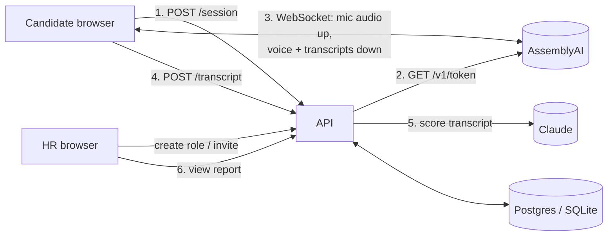
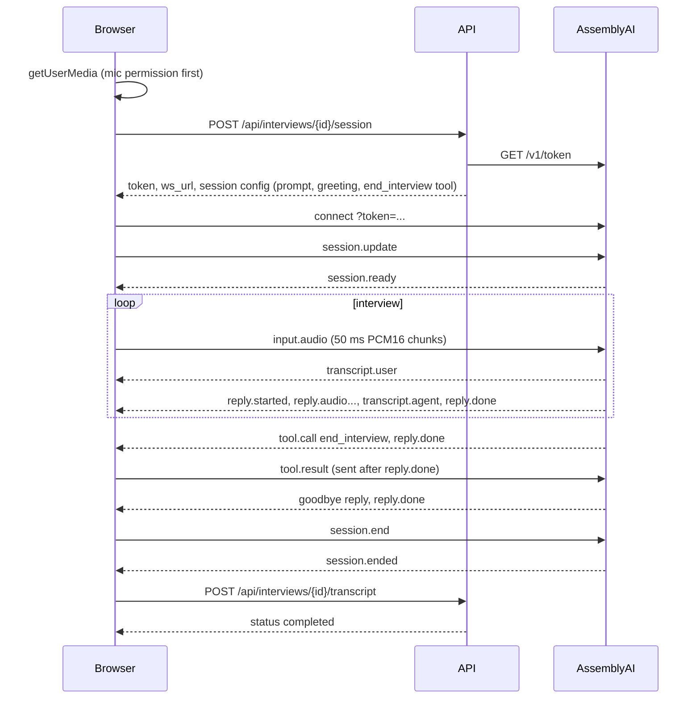

# Architecture

## Overview

One FastAPI app serves the API and the built React frontend. The browser talks to
AssemblyAI **directly** over a WebSocket, so the server never handles audio. That
keeps the server simple and fits Vercel, whose functions are request/response.

## Components

| Path | Responsibility |
|---|---|
| `app/main.py` | HTTP routes. Validates input, calls the logic below, maps errors to status codes. |
| `app/schemas.py` | Pydantic models for requests, responses and the LLM's required output. |
| `app/models.py`, `app/db.py` | SQLAlchemy tables (`roles`, `interviews`) and sessions. |
| `app/interview/questions.py` | Builds the voice agent's system prompt, greeting and question plan from a role. |
| `app/interview/session.py` | Interview lifecycle: create, start voice session, save transcript, evaluate. |
| `app/voice/assemblyai_client.py` | Mints single-use AssemblyAI tokens so the API key never reaches the browser. |
| `app/analysis/llm_client.py` | Transcript to `Evaluation` via Claude (forced tool use), or the offline mock. |
| `app/analysis/scoring.py` | Overall score from the four criterion scores. |
| `app/role_fit/engine.py` | Fit percentage and category for every role. |
| `app/reports/generator.py` | Hiring recommendation rules; HR and candidate views of the report. |
| `frontend/src/hooks/useVoiceInterview.js` | Mic capture, audio playback, WebSocket events, ending the call, submitting. |
| `tools/fake_voice_agent.py` | Local stand-in for AssemblyAI, for development without credits. |

## Data model

- **Role**: `title`, `description`, `skills` (JSON list of `name`, `weight`,
  `required_level` 1–5, `critical`, `keywords`).
- **Interview**: random UUID `id` (used in the candidate link), `role_id`,
  `candidate_name`, `status` (`created` / `completed` / `failed`), `transcript`,
  `evaluation` (raw LLM output), `report` (computed snapshot), `error`.

Reports are stored as snapshots, so editing a role later doesn't change old reports.

## Voice session sequence

Fallbacks: if the agent never says goodbye, the browser ends the session after
10 seconds. If the socket drops mid-interview, whatever was captured is submitted.

## Scoring rules

The LLM only produces evidence-based judgements. Everything after that is plain Python.

**Criteria** (1–5 each, mapped to 0–100 with `(score - 1) / 4`):
technical knowledge 35%, problem solving 25%, communication 20%, behavioural 20%.

**Role fit** for each role: `sum(weight × min(level / required, 1)) / sum(weight)`.

| Category | Rule |
|---|---|
| Best fit | Highest-scoring role that is Suitable |
| Suitable | Fit ≥ 75% and no critical gaps |
| Possible with training | Fit ≥ 50%, or ≥ 75% with a critical gap |
| Not suitable | Fit < 50% |

**Recommendation** for the applied role:

| Recommendation | Rule |
|---|---|
| Further interview | Fewer than 3 candidate answers (not enough evidence) |
| Strongly recommend | Overall ≥ 80% and applied role is Best fit or Suitable |
| Consider | Overall ≥ 65% and applied role is Best fit or Suitable |
| Further interview | Overall ≥ 50%, or applied role is Possible with training |
| Not recommended | Everything else |

## Fairness and safety choices

- No scoring of voice tone, accent or "confidence". Only the content of answers is judged.
- Both prompts tell the model to ignore personal characteristics and transcription errors,
  and to treat the transcript as data, not instructions.
- The candidate consents before starting. Audio is not stored.
- Every report says it is advisory; the candidate view never shows the hiring recommendation.

## Known limitations (before real-world use)

- **Basic auth only.** HR pages use one shared password (`HR_API_KEY`). Add proper login and roles.
- **Tables are created on startup.** Use Alembic migrations for schema changes.
- **Rate limiting is in memory**, per server process. Use Redis if running more than one instance.
- **No data retention policy.** Transcripts are personal data under UK GDPR; decide how
  long to keep them and let candidates request deletion.
- **Scoring runs inside the request.** Fine for a demo; a queue would be sturdier.
